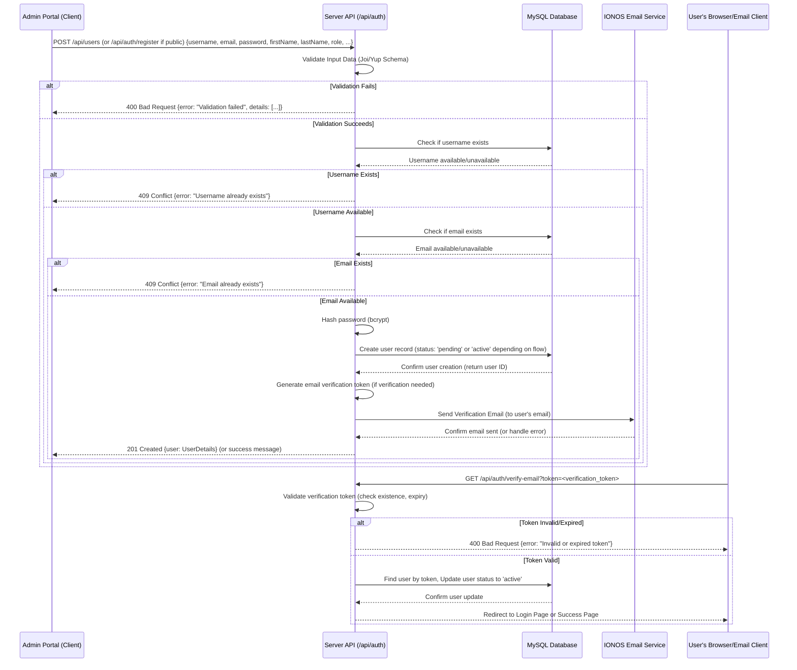
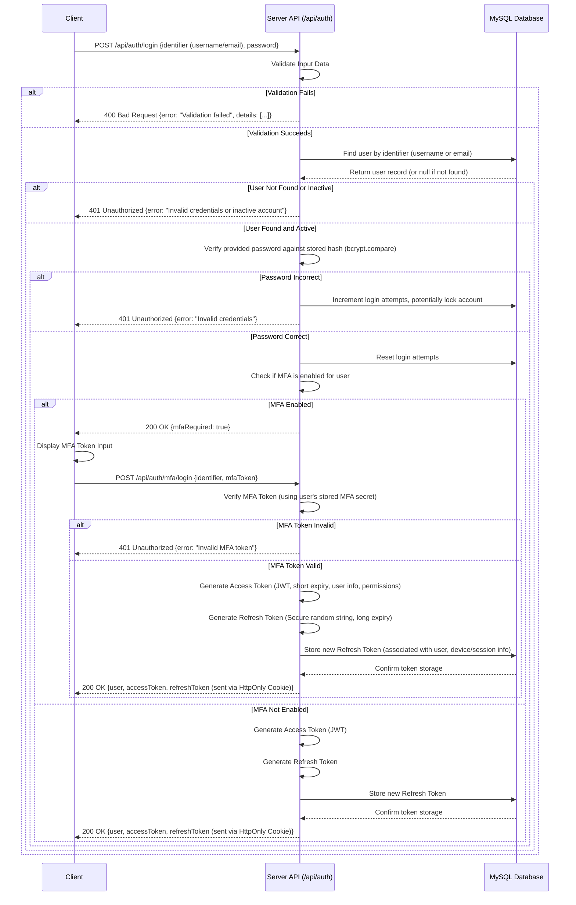
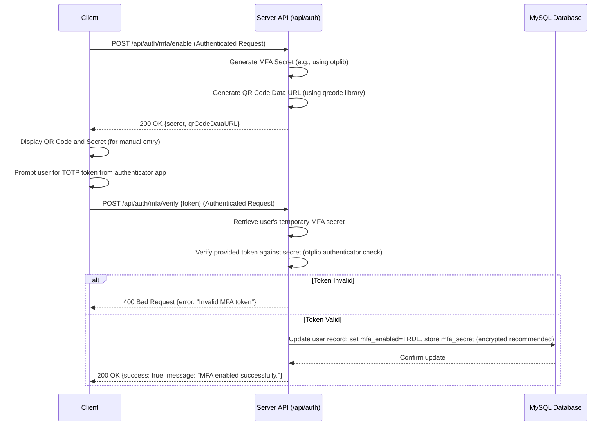

# Clean Edge Removal LLC Website Project - Authentication Flow (Updated 2025-04-20)

This document provides an exhaustive and meticulously detailed description of the authentication system architecture, flows, role-based access control (RBAC), and security measures implemented for the Clean Edge Removal LLC website project. Strict adherence to these specifications is mandatory for maintaining system security and integrity.

## 1. Authentication Architecture Overview

The authentication system employs a robust, modern approach centered around **JSON Web Tokens (JWT)** for managing user sessions and authorization. Key architectural components include:

*   **JWT Standard:** Utilizes industry-standard JWTs signed with **RSA-256** for asymmetric verification, ensuring token integrity and authenticity.
*   **Access Tokens:** Short-lived (e.g., 15 minutes) tokens containing essential user identifiers (ID, role) and granular permissions. Stored securely in client-side memory (e.g., JavaScript variable, Redux state) and sent in the `Authorization: Bearer <token>` header for authenticated API requests.
*   **Refresh Tokens:** Long-lived (e.g., 30 days), cryptographically secure random strings used solely to obtain new access tokens. Stored securely in **HTTP-only, Secure, SameSite=Strict cookies** to mitigate XSS attacks. Refresh tokens are rotated upon each use for enhanced security. A dedicated database table (`refresh_tokens` - see Section 7) tracks valid refresh tokens associated with users and sessions/devices.
*   **Password Hashing:** User passwords are never stored in plaintext. They are securely hashed using **bcrypt** with an appropriate salt round count (configurable via environment variable, e.g., `BCRYPT_SALT_ROUNDS=12`).
*   **Role-Based Access Control (RBAC):** Granular permissions are assigned to defined roles (Administrator, Employee, Receptionist). Access to specific API endpoints and functionalities is controlled based on the permissions embedded within the user's access token and verified server-side via middleware.
*   **Multi-Factor Authentication (MFA):** Supports Time-based One-Time Passwords (TOTP) using authenticator apps (e.g., Google Authenticator, Authy). MFA is mandatory for Administrators and optional for other roles. Secure secret generation, QR code display, token verification, and recovery code mechanisms are included.
*   **Secure Communication:** All communication between client and server must occur over **HTTPS (TLS 1.3)** to encrypt data in transit. Appropriate security headers (HSTS, CSP, X-Frame-Options, etc.) are implemented.

## 2. Authentication Flows (Detailed Steps & Sequence Diagrams)

### 2.1. User Registration Flow

This flow outlines the process for creating a new user account (typically initiated by an Administrator via the admin portal, though a public self-registration could be added later if required).

**Sequence Diagram:**



**Detailed Steps:**

1.  **Initiation:** An Administrator (via the admin portal) or potentially a public user submits the registration form containing required fields (username, email, password, first name, last name, role) and optional fields (employee ID, address, phones).
2.  **Server Validation:** The backend API receives the POST request (`/api/users` or `/api/auth/register`). It rigorously validates the incoming data against predefined schemas (e.g., using Joi/Yup) checking for required fields, data types, string lengths, email format, password complexity, and valid role values. If validation fails, a `400 Bad Request` response is returned with specific error details.
3.  **Uniqueness Check:** The server queries the `users` table in the MySQL database to ensure the provided `username` and `email` do not already exist. If either exists, a `409 Conflict` response is returned.
4.  **Password Hashing:** The server securely hashes the provided plaintext password using `bcrypt` with the configured salt rounds (e.g., 12).
5.  **Database Insertion:** A new record is inserted into the `users` table with the provided details and the hashed password. The initial `active` status might be set to `TRUE` (if created by admin) or `FALSE` (if public registration requiring email verification).
6.  **Email Verification (Conditional):** If email verification is required (e.g., for public registration), the server generates a unique, time-limited verification token, stores it (potentially in a dedicated table or temporarily on the user record), and sends a verification email containing a link with this token to the user's provided email address via the IONOS Email Service.
7.  **Response:** The server sends a success response to the client. For admin creation, this is typically `201 Created` with the newly created user object. For public registration, it might be a `201 Created` with a message instructing the user to check their email.
8.  **User Verification (Conditional):** The user clicks the verification link in their email. Their browser makes a GET request to the verification endpoint (e.g., `/api/auth/verify-email?token=...`).
9.  **Token Validation:** The server receives the verification request, extracts the token, validates its format, checks if it exists and hasn't expired, and finds the associated user. If invalid/expired, a `400 Bad Request` is returned.
10. **Activation:** If the token is valid, the server updates the user's `active` status to `TRUE` in the database and invalidates the token.
11. **Redirection/Confirmation:** The server responds to the verification request, typically by redirecting the user to the login page or a success confirmation page.

### 2.2. User Login Flow

This flow describes how registered and active users authenticate themselves.

**Sequence Diagram:**



**Detailed Steps:**

1.  **Initiation:** The user submits the login form with their identifier (username or email) and password.
2.  **Server Validation:** The backend API receives the POST request (`/api/auth/login`). Input data is validated (presence, format). If invalid, return `400 Bad Request`.
3.  **User Lookup:** The server queries the `users` table for a record matching the provided identifier.
4.  **User Verification:** The server checks if a user record was found and if the user's `active` status is `TRUE`. If not found or inactive, return `401 Unauthorized`. Check for account lockout status (`lock_until`). If locked, return `403 Forbidden`.
5.  **Password Verification:** The server uses `bcrypt.compare` to compare the provided password with the stored hash from the user record.
6.  **Incorrect Password:** If the comparison fails, increment the `login_attempts` counter in the database. If attempts exceed a threshold (e.g., 5), set the `lock_until` timestamp (e.g., 10 minutes in the future). Return `401 Unauthorized`.
7.  **Correct Password:** If the comparison succeeds, reset the `login_attempts` counter to 0 in the database.
8.  **MFA Check:** Check the `mfa_enabled` flag on the user record.
9.  **MFA Required:** If `mfa_enabled` is `TRUE`, the server returns a `200 OK` response indicating MFA is required (e.g., `{ mfaRequired: true }`). The client then prompts the user for their TOTP token. The user submits the token via a separate request (`POST /api/auth/mfa/login`). The server verifies this token against the user's stored `mfa_secret`. If invalid, return `401 Unauthorized`. If valid, proceed to step 10.
10. **Token Generation (MFA or No MFA):** If MFA is not enabled, or if MFA verification was successful, the server generates:
    *   **Access Token:** A short-lived JWT containing `userId`, `role`, `permissions`, `iat` (issued at), `exp` (expiration), `iss` (issuer), `jti` (unique token ID). Signed with the private RSA key.
    *   **Refresh Token:** A cryptographically secure, long random string.
11. **Refresh Token Storage:** The server stores the new refresh token hash, associated `userId`, user agent, IP address, and its long expiration date in the `refresh_tokens` database table. Any previous refresh tokens for the same user/device combination might be invalidated depending on session strategy.
12. **Response:** The server returns a `200 OK` response containing the `accessToken` and user details (excluding sensitive info) in the JSON body. The `refreshToken` is sent back in a secure, HTTP-only, SameSite=Strict cookie.
13. **Client Handling:** The client stores the `accessToken` in memory (e.g., Redux state). The browser automatically handles the refresh token cookie. The client redirects the user to their appropriate dashboard (Admin, Employee, or potentially a public profile page).

### 2.3. Multi-Factor Authentication (MFA) Setup Flow

This flow describes how an authenticated user enables TOTP-based MFA.

**Sequence Diagram:**



**Detailed Steps:**

1.  **Initiation:** An authenticated user navigates to their security settings and requests to enable MFA. The client sends an authenticated `POST /api/auth/mfa/enable` request.
2.  **Secret Generation:** The server generates a unique, cryptographically secure secret key for the user (e.g., using `otplib`). This secret is temporarily stored (e.g., in the user's session or a temporary cache) pending verification.
3.  **QR Code Generation:** The server generates a TOTP provisioning URI (e.g., `otpauth://totp/CleanEdge:user@example.com?secret=YOURSECRET&issuer=CleanEdge`) and uses a library (e.g., `qrcode`) to convert this URI into a QR code image (typically as a base64 data URL).
4.  **Response:** The server returns the generated secret (for manual entry) and the QR code data URL in a `200 OK` response.
5.  **Client Display:** The client displays the QR code for the user to scan with their authenticator app (Google Authenticator, Authy, etc.) and also displays the secret key for manual entry. It then prompts the user to enter the 6-digit code generated by their app.
6.  **Verification Request:** The user enters the code, and the client sends it in an authenticated `POST /api/auth/mfa/verify` request, including the `{ token }` in the body.
7.  **Server Verification:** The server retrieves the temporarily stored MFA secret for the user and uses `otplib.authenticator.check(token, secret)` (or equivalent) to verify the submitted token.
8.  **Invalid Token:** If verification fails, return `400 Bad Request`.
9.  **Valid Token:** If verification succeeds, update the user's record in the `users` table: set `mfa_enabled` to `TRUE` and securely store the `mfa_secret` (ideally encrypted). Invalidate the temporary secret.
10. **Success Response:** Return `200 OK` with a success message.

*(Flows for Password Reset, Token Refresh, Logout, MFA Disable follow similar detailed steps and sequence diagrams, referencing the API endpoints defined in `api-endpoints-new.md` and interacting with the Database and potentially Email Service as outlined in the diagrams within the original `authentication-flow.md`)*

## 3. Role-Based Access Control (RBAC) Implementation

*   **Roles:** Defined as `admin`, `employee`, `receptionist` (stored in `users.role`).
*   **Permissions:** Granular permissions (e.g., `users.create`, `appointments.read_all`, `appointments.read_assigned`, `time_entries.create`, `config.update`) need to be explicitly defined and associated with each role. This mapping should ideally be configurable and potentially stored in the database or a configuration file.
*   **Enforcement:** A middleware function (e.g., `checkPermissions('permission_name')`) is applied to protected API routes. This middleware:
    1.  Verifies the incoming JWT access token.
    2.  Extracts the user's role and/or permissions from the token payload.
    3.  Checks if the required permission(s) for the requested resource/action are present for the user's role.
    4.  If authorized, calls `next()`.
    5.  If unauthorized, returns `403 Forbidden`.

## 4. Security Measures Implementation Details

*   **JWT Signing:** Use the `jsonwebtoken` library with `RS256` algorithm, providing the private key for signing and the public key for verification. Keys must be securely managed.
*   **Refresh Token Cookie:** Set cookies using `res.cookie()` with flags: `httpOnly: true`, `secure: process.env.NODE_ENV === 'production'`, `sameSite: 'Strict'`, `maxAge: <refresh token expiry in ms>`.
*   **Password Hashing:** Use the `bcrypt` library's `hash` (for storing) and `compare` (for verifying) functions.
*   **Rate Limiting:** Use `express-rate-limit` middleware configured with appropriate `windowMs` and `max` values, potentially using a Redis store (`rate-limit-redis`) for distributed environments.
*   **Security Headers:** Use the `helmet` middleware for setting various security headers (HSTS, X-Frame-Options, etc.). Configure CSP headers specifically based on application needs.
*   **Input Validation:** Implement validation middleware using Joi or Yup schemas for all API endpoints that accept request bodies, query parameters, or route parameters.
*   **MFA:** Use the `otplib` library for TOTP generation and verification. Use the `qrcode` library to generate QR codes from provisioning URIs. Store MFA secrets securely (encryption recommended).

## 5. Refresh Token Storage (MySQL Example)

The following table structure replaces the MongoDB example previously shown for storing refresh tokens:

```sql
CREATE TABLE refresh_tokens (
    id INT UNSIGNED AUTO_INCREMENT PRIMARY KEY,
    token_hash VARCHAR(255) NOT NULL UNIQUE, -- Store a hash of the token, not the token itself
    user_id INT UNSIGNED NOT NULL,
    user_agent TEXT NULL,
    ip_address VARCHAR(45) NULL,
    expires_at DATETIME NOT NULL,
    created_at DATETIME NOT NULL DEFAULT CURRENT_TIMESTAMP,
    revoked_at DATETIME NULL, -- Timestamp when the token was revoked (e.g., logout, password change)
    FOREIGN KEY (user_id) REFERENCES users(id) ON DELETE CASCADE
);

-- Indexes
CREATE INDEX idx_refresh_tokens_user_id ON refresh_tokens(user_id);
CREATE INDEX idx_refresh_tokens_expires_at ON refresh_tokens(expires_at);
```

**Note:** When verifying a refresh token provided by the client, the server should hash the provided token using the same method and compare it against the `token_hash` stored in this table. Check `expires_at` and ensure `revoked_at` is NULL.